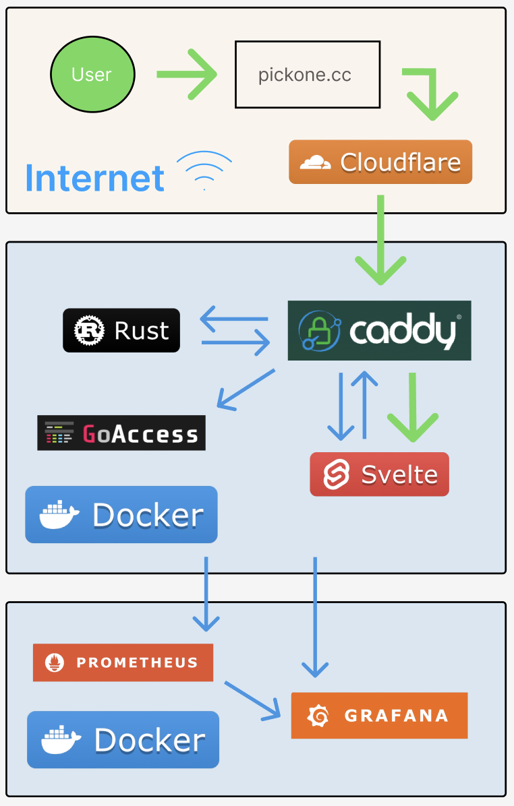
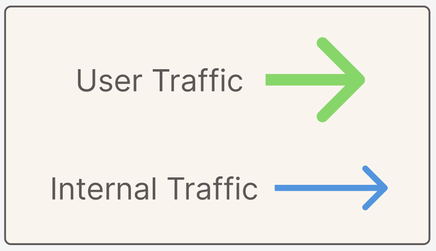

# PickOne: Real Time Voting System

[](#built-with)
[](#built-with)
[](#built-with)
[](#built-with)
[](#built-with)
[](#built-with)

PickOne is a real-time voting system.

**Try it live:** [pickone.cc](https://pickone.cc/)


## Table of Contents

- [Built With](#built-with)
  - [Technologies](#technologies)
  - [Architectural Diagram](#architecture-diagram)
  - [Architecture Explanation](#architecture-explanation)
- [Additional Demos](#additional-demos)
- [Getting Started](#getting-started)

## Built With

### Technologies

[](https://www.debian.org/)
[](https://www.docker.com/)  
Deployed on multiple Debian nodes using Docker Swarm

[](https://www.cloudflare.com/)
[](https://caddyserver.com)  
Hosted using reverse proxy by Caddy and Cloudflare

[](https://www.rust-lang.org/)  
Backend using Rust

[](https://www.figma.com/)
[](https://www.typescriptlang.org/)
[](https://svelte.dev/)  
Frontend using [Figma](https://www.figma.com/design/3TCMv4E68enOcQ3quqRtO4/pickone?node-id=0-1&t=GrwhKBXnhd69lmop-1) and Typescript for Svelte

[](https://grafana.com/) [](https://prometheus.io/) [](https://goaccess.io/)  
Devops using Grafana (GUI, Dashboards, Loki Logging), Prometheus (Metrics, Uptime), GoAccess (Web Stats)

### Architecture Diagram

[](https://www.figma.com/design/3TCMv4E68enOcQ3quqRtO4/pickone?node-id=0-1&t=GrwhKBXnhd69lmop-1)[](https://www.figma.com/design/3TCMv4E68enOcQ3quqRtO4/pickone?node-id=0-1&t=GrwhKBXnhd69lmop-1)  
This diagram visualizes the architecture of the software stack. Using the legend, the green arrows represent network flow for the user and the blue arrows represent network flow for internal operations including processing the votes, metrics, and logs.

The diagram is also available through [Figma](https://www.figma.com/design/3TCMv4E68enOcQ3quqRtO4/pickone?node-id=0-1&t=GrwhKBXnhd69lmop-1).

### Architecture Explanation

The user first arrives at our domain of https://pickone.cc. From the domain, Cloudflare tunnels the user into our Docker machine directly to Caddy. Caddy then reverse proxies the user to the website hosted by Svelte. At this point, Svelte will go through Caddy to communicate with Rust in order to start a new websocket connection and process votes. Rust communicates back similarly through the Caddy reverse proxy.

As for the Devops, Caddy sends the request logs to be processed internally by GoAccess. In addition, all logs and metrics are sent to the other Docker node for Prometheus and Grafana to process, finally to be presented in a GUI hosted by Grafana.

## Additional Demos

[](https://goaccess.io/)  
Screenshots showing examples statistics provided by GoAccess including overview stats, unique visitors, and requested links.  


[](https://grafana.com/) [](https://prometheus.io/)  
The Grafana dashboard visualizes stats including the uptime, total users ever, number of concurrent users, and number of votes for each category for the past 24 hours.  


## Getting Started

### Requirements

Before running this project locally, make sure you have the following installed:

- [Git](https://git-scm.com/downloads)
- [Docker](https://docs.docker.com/engine/install/)
- [Docker Logging Plugin](https://grafana.com/docs/loki/latest/send-data/docker-driver/)

### Local Deployment

1. **Clone the repository**

   ```bash
   git clone https://github.com/dadal00/PickOne.git
   cd PickOne
   ```

2. **Add this to /etc/hosts**

   ```bash
   127.0.0.1	boiler
   ```

3. **Load environment**

   ```bash
   set -a
   source .env.local
   ```

4. **Build the docker images**

   ```bash
   docker compose -f deploy/docker-build.main.yml build
   ```

5. **Start the swarm**

   ```bash
   docker swarm init
   ```

6. **Create backend hash salt**

   ```bash
   echo "your-own-salt" | docker secret create RUST_HASH_SALT -
   ```

7. **Create monitoring network**

   ```bash
   docker network create \
   --driver overlay \
   --attachable \
   --internal \
   --opt encrypted \
   monitor_net
   ```

8. **Create necessary files**

   ```bash
   touch deploy/caddy/logs/access.log
   touch deploy/saved_state.json
   touch monitor/goaccess/www/report.html
   ```

9. **Deploy the monitoring stack**

   ```bash
   docker stack deploy -c monitor/docker-swarm.monitor.local.yml monitor
   ```

10. **Deploy the main app stack**

    ```bash
    docker stack deploy -c deploy/docker-swarm.main.local.yml counter
    ```

11. **Visit the local websites**

- [Local PickOne](https://pickone/)
- [Local Grafana](http://localhost:3000/)
- GoAccess Report: Paste absolute path of `monitor/goaccess/www/report.html` into browser to view live
  - Example Absolute Path: `/Users/dadal00/Documents/PickOne/monitor/goaccess/www/report.html`
